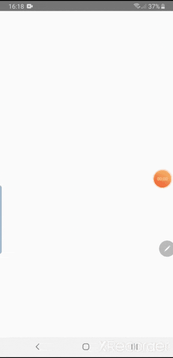

# React Native Picker

**Cross-platform** Picker or Selector for React Native with **zero dependency** and heavily customizable styling.

###### Created by Cheng Sokdara of rawewhat

## Demo


## [Changelog](https://github.com/rawewhat/react-native-paper/blob/master/CHANGELOG.md)

## Content

- [Install](#install)
- [Usage](#usage)
- [API](#api)
- [Example](#example)
- [License](#license)

## Install

using npm  
`npm install @rawewhat/react-native-paper`

using yarn  
`yarn add @rawewhat/react-native-paper`

## Usage

- just import Picker in any component you want to use it

`import { Picker } from '@rawewhat/react-native-picker'`  
`import Picker from '@rawewhat/react-native-picker'`

- then use it in your return function or render function

`return <Picker />`

## API

### 1. Important props
| Name               | Type           | Default                        | Description                                                                             |
| ------------------ | -------------- | ------------------------------ | --------------------------------------------------------------------------------------- |
| data               | array          | [{ label: "None", value: "" }] | Array of object to generate selectable list items.                                      |
| disabled           | boolean        | undefined                      | Disable picker onPress event.                                                           |
| error              | boolean        | false                          | Show red border when there is error.                                                    |
| label              | string         | undefined                      | Label that show above the picker text.                                                  |
| labelField         | string         | "label"                        | Configure which object property in data to use as list item text.                       |
| placeholder        | string         | "Press to select"              | When there is no value, placeholder text will be shown.                                 |
| title              | string         | "Picker"                       | Title above selectable list item.                                                       |
| value              | string         | undefined                      | Control picker selected value.                                                          |
| valueField         | string         | "value"                        | Configure which object property in data to use for conparing selected value.            |
| canTouchOutside    | boolean        | true                           | Whether user can click outside list item to close.                                      |
| caretPng           | .png           | undefined                      | Caret icon in png format. `Ex: caretPng={require(./caret.png)}`                         |
| caretSvg           | component      | undefined                      | Caret icon in react-native-svg format. `Ex: caretSvg={<CaretSvg />}`                    |
| withLine           | boolean        | undefined                      | Show line below picker text and list item title.                                        |

### 2. Quick styling
| Name               | Type           | Default                        | Description                                                                             |
| ------------------ | -------------- | ------------------------------ | --------------------------------------------------------------------------------------- |
| height             | number\|string | 50                             | Height of the picker button.                                                            |
| modalElevation     | number         | 10                             | Control picker modal drop shadow and zIndex on Android.                                 |
| modalRadius        | number         | 10                             | Control picker modal top-left and top-right border radius.                              |
| overlayOpacity     | float          | 0.0                            | Control opacity of overlay outside list item.                                           |
| pickerElevation    | number         | 2                              | Control picker button drop shadow and zIndex on Android.                                |
| pickerRadius       | number         | 5                              | Control picker button border radius.                                                    |
| spacing            | number         | 0                              | Control picker button margin bottom.                                                    |
| width              | number\|string | "auto"                         | Width of the picker button.                                                             |

### 3. Override props
| Name               | Type           | Default                        | Description                                                                             |
| ------------------ | -------------- | ------------------------------ | --------------------------------------------------------------------------------------- |
| listProps          | object         | undefined                      | Override <FlatList> props.                                                              |
| listItemProps      | object         | undefined                      | Override list item <TouchableOpacity> props.                                            |
| modalProps         | object         | undefined                      | Override list container <View> props.                                                   |
| pickerProps        | object         | undefined                      | Override picker button <TouchableOpacity> props.                                        |

### 4. Override style
| Name               | Type           | Default                        | Description                                                                             |
| ------------------ | -------------- | ------------------------------ | --------------------------------------------------------------------------------------- |
| style              | object         | undefined                      | Override picker button <TouchableOpacity> style.                                        |
| caretStyle         | object         | undefined                      | Override caret png or svg component style.                                              |
| itemTextStyle      | object         | undefined                      | Override list item text style.                                                          |
| labelStyle         | object         | undefined                      | Override label text style.                                                              |
| lineStyle          | object         | undefined                      | Override picker button and modal title line <View> style.                               |
| listContentStyle   | object         | undefined                      | Override <FlatList> contentContainer style.                                             |
| listSeparatorStyle | object         | undefined                      | Override <FlatList> ItemSeparator component style.                                      |
| listStyle          | object         | undefined                      | Override <FlatList> style.                                                              |
| listTitleStyle     | object         | undefined                      | Override modal title <Text> style.                                                      |
| modalStyle         | object         | undefined                      | Override list container <View /> style.                                                 |
| overlayStyle       | object         | undefined                      | Override overlay <TouchableOpacity> style.                                              |
| textStyle          | object         | undefined                      | Override picker button <Text> style.                                                    |

### 5. Callback
| Name               | Type           | Default                        | Description                                                                             |
| ------------------ | -------------- | ------------------------------ | --------------------------------------------------------------------------------------- |
| onChange           | function       | undefined                      | Callback when list item pressed. `(item: object, index: number) => {}`                  |
| onClose            | function       | undefined                      | Callback when modal closed. `() => {}`                                                  |

## Example

### 1. Basic usage
```javascript
import React from "react";
import { StyleSheet, View } from "react-native";
import { Picker } from "@rawewhat/react-native-picker";

const data = [
  { id: "1", label: "Label 1", value: "value1" },
  { id: "2", label: "Label 2", value: "value2" },
];

const App = () => {
  const _handleChange = (item, index) => {
    console.log("_handleChange", item);
  };

  return (
    <View>
      <Picker data={data} onChange={_handleChange} />
    </View>
  );
};

const styles = StyleSheet.create({
  container: {
    flex: 1,
    justifyContent: "center",
    paddingHorizontal: 20,
  },
});

export default App;
```

### 2. Different data structure
```javascript
...
const data = [
  { id: "sdf8fs8f7sdfsd8f58fsd8f58s5df8sd6f5", first_name: "Name 1", qrCode: "code1" },
  { id: "f8sd7f9sd9f8ds9f8sdf8dsf989987sd9fd", first_name: "Name 2", qrCode: "code2" },
];

const App = () => {
  const _handleChange = (item, index) => {
    console.log("_handleChange", item);
  };

  return (
    <View>
      <Picker data={data} labelField="first_name" valueField="qrCode" onChange={_handleChange} />
    </View>
  );
};
...
```

## License

```
MIT License
-----------

Copyright (c) 2019 Cheng Sokdara (https://rawewhat-team.com)
Permission is hereby granted, free of charge, to any person
obtaining a copy of this software and associated documentation
files (the "Software"), to deal in the Software without
restriction, including without limitation the rights to use,
copy, modify, merge, publish, distribute, sublicense, and/or sell
copies of the Software, and to permit persons to whom the
Software is furnished to do so, subject to the following
conditions:

The above copyright notice and this permission notice shall be
included in all copies or substantial portions of the Software.

THE SOFTWARE IS PROVIDED "AS IS", WITHOUT WARRANTY OF ANY KIND,
EXPRESS OR IMPLIED, INCLUDING BUT NOT LIMITED TO THE WARRANTIES
OF MERCHANTABILITY, FITNESS FOR A PARTICULAR PURPOSE AND
NONINFRINGEMENT. IN NO EVENT SHALL THE AUTHORS OR COPYRIGHT
HOLDERS BE LIABLE FOR ANY CLAIM, DAMAGES OR OTHER LIABILITY,
WHETHER IN AN ACTION OF CONTRACT, TORT OR OTHERWISE, ARISING
FROM, OUT OF OR IN CONNECTION WITH THE SOFTWARE OR THE USE OR
OTHER DEALINGS IN THE SOFTWARE.
```
